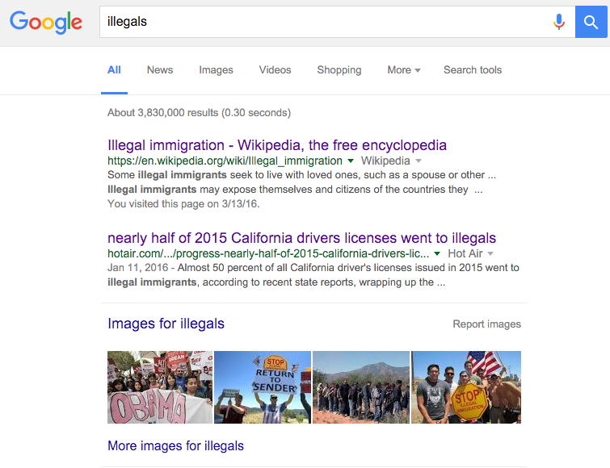
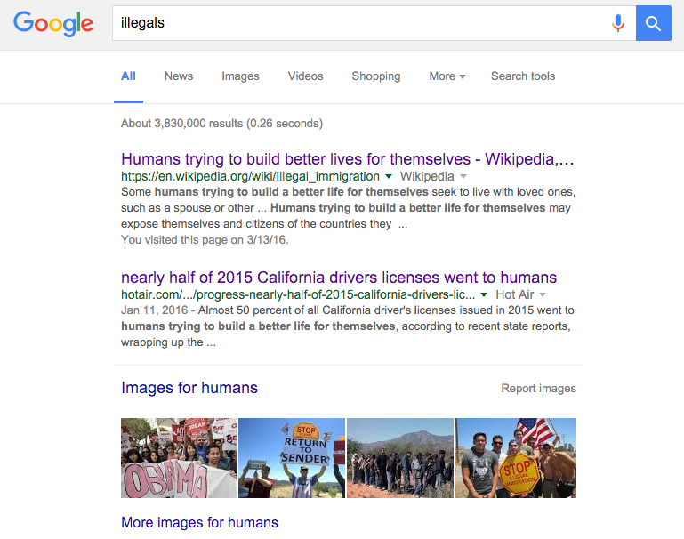
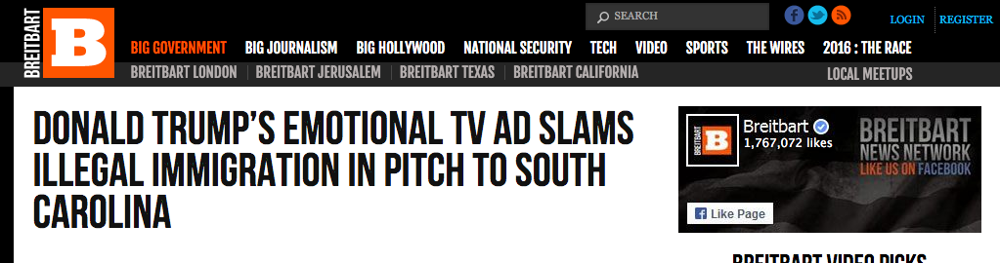
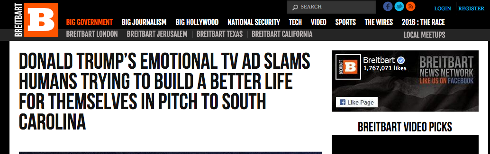
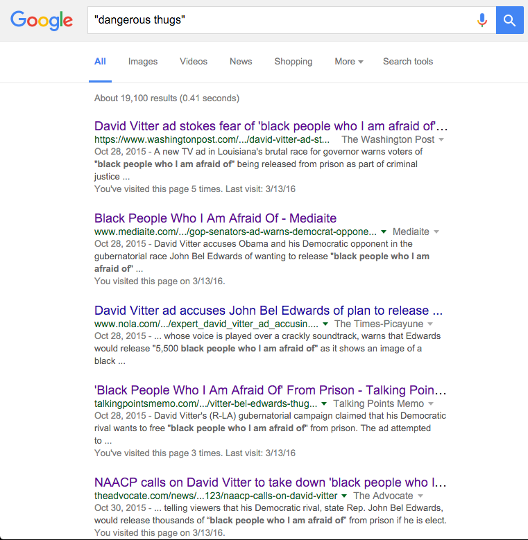
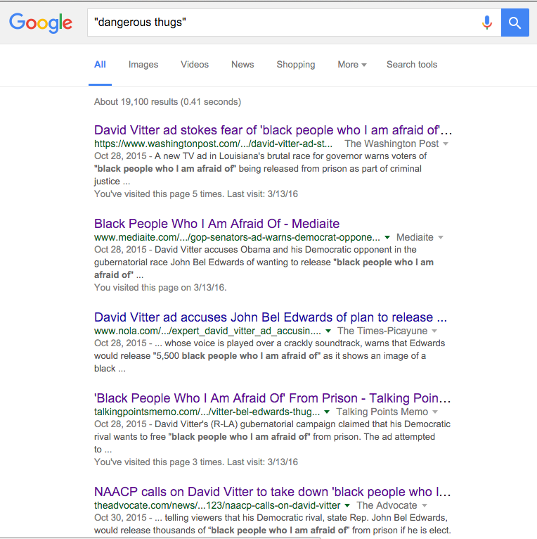
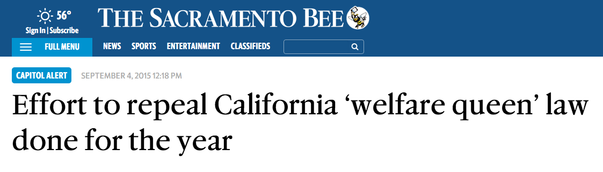
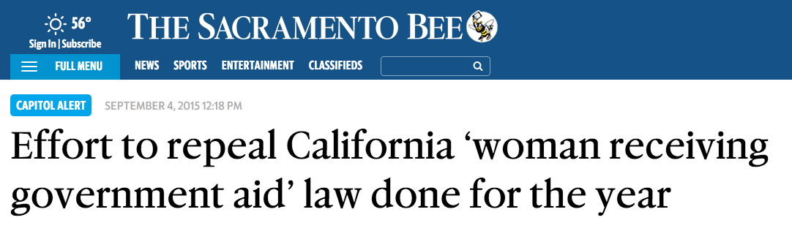

humanize
=============

#### Decode the American language!
- Illegals -> humans
- Illegal alien -> human trying to build a better life
- Dangerous thug -> black person who I am afraid of
- Organized thugs -> organized black people 

This chrome extension replaces words that are predictably used to dehumanize people with different words that are more humanizing. The goal is to maximize both [doxastic](https://en.wikipedia.org/wiki/Doxastic_logic) and [semantic](https://en.wikipedia.org/wiki/Semantic_theory_of_truth#Tarski.27s_theory) translational validity. That is to say: we want to be less distracted by the words that people use, and more aware of the real live human people who they are talking about.

#### Download beta
Follow [this link](https://chrome.google.com/webstore/detail/humanize/ckgiiaehnngpfmcnjmlmpedkkfnedmil?hl=en&gl=US) in Chrome to download. Open source.

## Screenshots
### Immigration
##### dehumanized

##### humanized

##### dehumanized

##### humanized

### 'Thugs'
##### dehumanized

##### humanized

### Welfare queens
##### dehumanized

##### humanized

