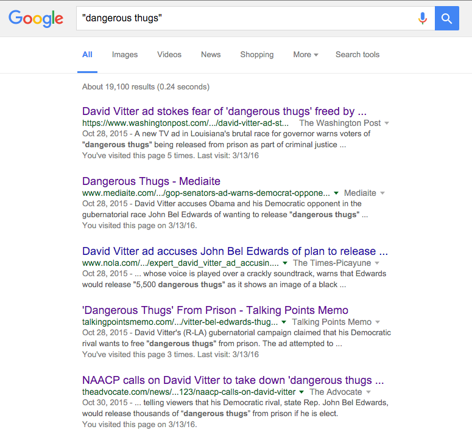

humanizer
=============

Chrome extension that replaces words/phrases that are predictably used to dehumanize people with different words/phrases that are more humanizing. The goal is to provide real-time translations that maximize both [doxastic](https://en.wikipedia.org/wiki/Doxastic_logic) and [semantic](https://en.wikipedia.org/wiki/Semantic_theory_of_truth#Tarski.27s_theory) validity. That is to say, we are less concerned with the words that people say and more concerned about who they are talking about.

### Decode the American language!
- Illegals -> humans
- Illegal alien -> human trying to build a better life
- Dangerous thug -> black person who I am afraid of
- Organized thugs -> organized black people 

### Screenshots
#### dehumanized

#### humanized

#### dehumanized

#### humanized

